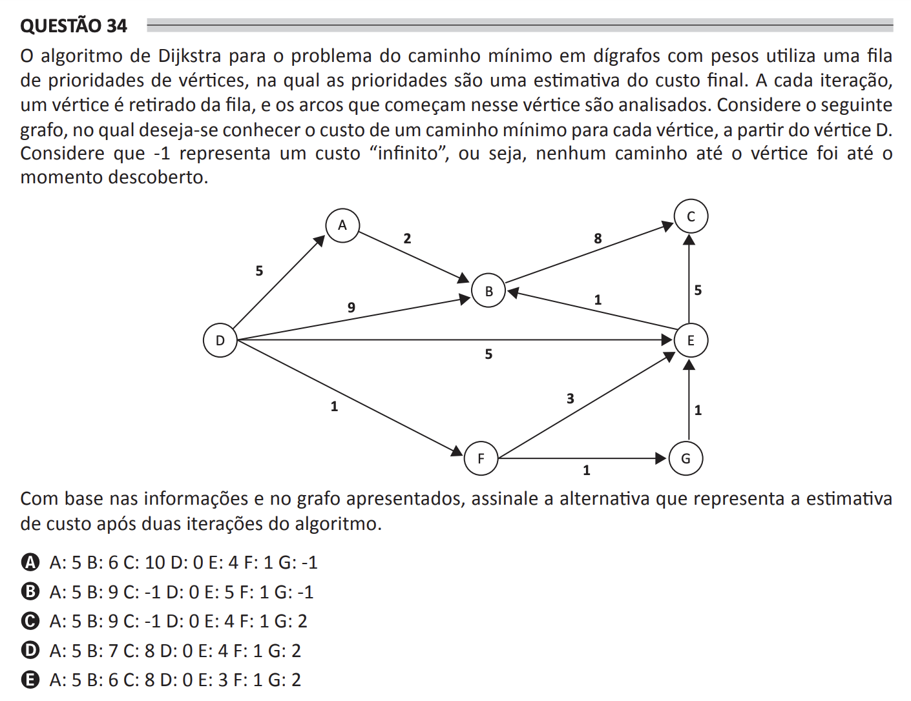

# ENADE 2021 Computer Science - Question 34

## Original question image

## English translation

Dijkstra’s algorithm for the shortest path problem in weighted directed graphs uses a priority queue of vertices, in which the priorities are an estimate of the final cost. At each iteration, a vertex is removed from the queue, and the arcs that start at that vertex are analyzed. Consider the following graph, in which the goal is to know the cost of a shortest path to each vertex, starting from vertex D. Consider that -1 represents an “infinite” cost, that is, no path to the vertex has been discovered so far.

Based on the information and on the graph presented, choose the alternative that represents the cost estimate after two iterations of the algorithm.

A. A: 5 B: 6 C: 10 D: 0 E: 4 F: 1 G: -1  
B. A: 5 B: 9 C: -1 D: 0 E: 5 F: 1 G: -1  
C. A: 5 B: 9 C: -1 D: 0 E: 4 F: 1 G: 2  
D. A: 5 B: 7 C: 8 D: 0 E: 4 F: 1 G: 2  
E. A: 5 B: 6 C: 8 D: 0 E: 3 F: 1 G: 2

## Prompt

Answer the question(s) in this image by explaining step by step the reasoning used to answer it/them. Inform if any question is not clear or does not have a possible answer.
