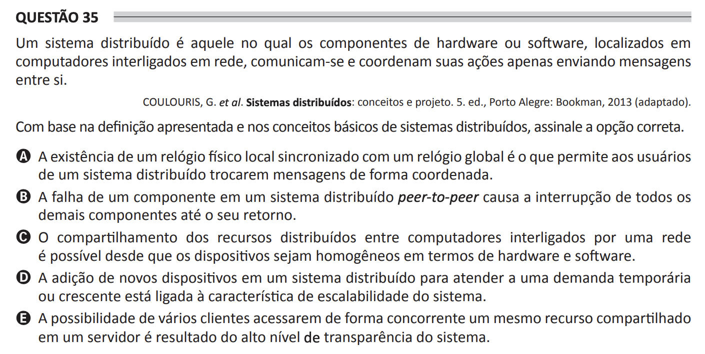

# ENADE 2021 Computer Science - Question 35

## Original question image

## English translation

A distributed system is one in which hardware or software components, located on networked computers, communicate and coordinate their actions only by sending messages to each other.

COULOURIS, G. et al. Distributed Systems: Concepts and Design. 5th ed., Porto Alegre: Bookman, 2013 (adapted).

Based on the definition presented and on the basic concepts of distributed systems, choose the correct option.

A. The existence of a local physical clock synchronized with a global clock is what allows users of a distributed system to exchange messages in a coordinated way.

B. The failure of a component in a peer-to-peer distributed system causes the interruption of all other components until it returns.

C. Sharing distributed resources among computers connected by a network is possible as long as the devices are homogeneous in terms of hardware and software.

D. Adding new devices to a distributed system to meet temporary or growing demand is related to the system’s scalability characteristic.

E. The possibility of several clients concurrently accessing the same shared resource on a server is the result of the system’s high level of transparency.

## Prompt

Answer the question(s) in this image by explaining step by step the reasoning used to answer it/them. Inform if any question is not clear or does not have a possible answer.
