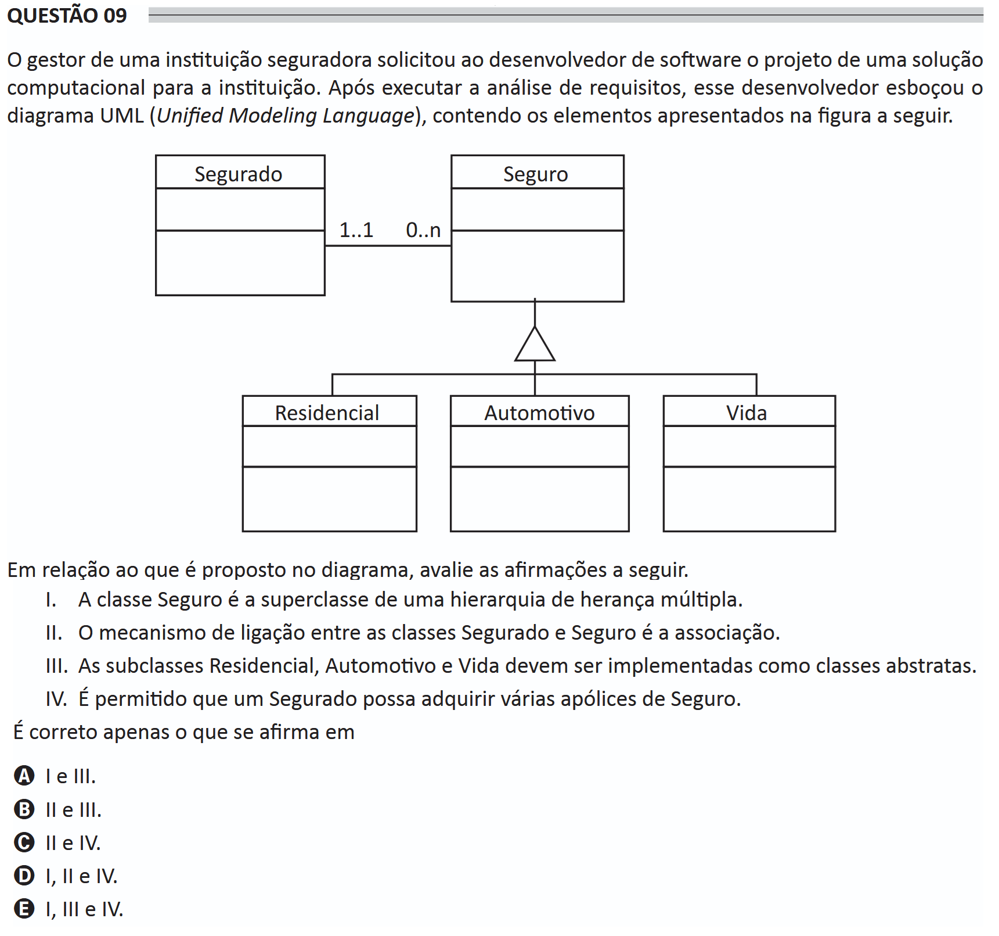

# ENADE 2021 Information Systems - Question 09

## Original question image

## English translation

The manager of an insurance institution asked the software developer to design a computational solution for the institution. After performing the requirements analysis, this developer sketched the UML (Unified Modeling Language) diagram containing the elements shown in the following figure.

Regarding what is proposed in the diagram, evaluate the following statements.

I. The class `Seguro` is the superclass of a multiple-inheritance hierarchy.  
II. The linking mechanism between the classes `Segurado` and `Seguro` is association.  
III. The subclasses `Residencial`, `Automotivo`, and `Vida` must be implemented as abstract classes.  
IV. It is permitted for one `Segurado` to acquire several insurance policies.

It is correct only what is stated in:

A. I and III.  
B. II and III.  
C. II and IV.  
D. I, II, and IV.  
E. I, III, and IV.

## Prompt

Answer the question(s) in this image by explaining step by step the reasoning used to answer it/them. Inform if any question is not clear or does not have a possible answer.
