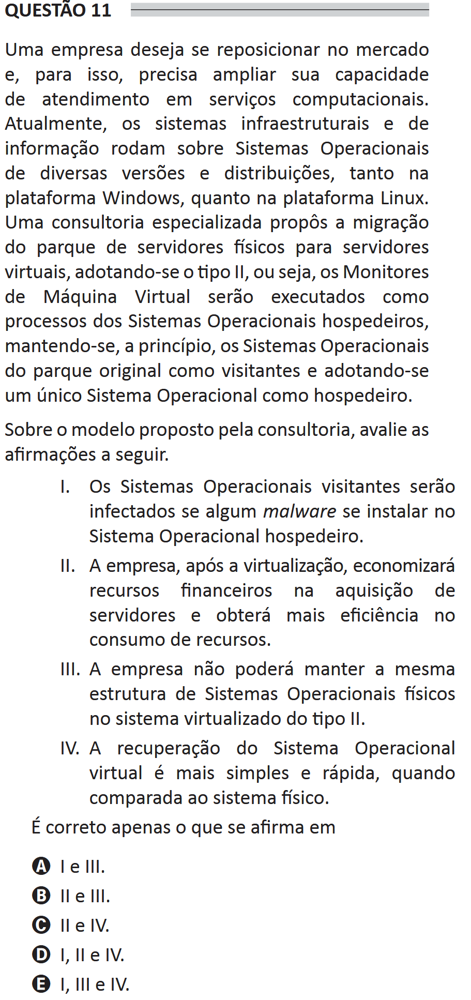

# ENADE 2021 Information Systems - Question 11

## Original question image

## English translation

A company wants to reposition itself in the market and, for that purpose, needs to expand its service capacity in computational services. Currently, its infrastructure and information systems run on Operating Systems of various versions and distributions, both on the Windows platform and on the Linux platform. A specialized consulting company proposed migrating the physical server infrastructure to virtual servers, adopting type II virtualization; that is, the Virtual Machine Monitors will be executed as processes of the host Operating Systems, initially keeping the Operating Systems from the original infrastructure as guests and adopting a single Operating System as the host.

Regarding the model proposed by the consulting company, evaluate the following statements.

I. The guest Operating Systems will be infected if malware is installed on the host Operating System.  
II. After virtualization, the company will save financial resources in the acquisition of servers and will obtain greater efficiency in resource consumption.  
III. The company will not be able to maintain the same structure of physical Operating Systems in the type II virtualized system.  
IV. Recovery of the virtual Operating System is simpler and faster when compared to the physical system.

It is correct only what is stated in:

A. I and III.  
B. II and III.  
C. II and IV.  
D. I, II, and IV.  
E. I, III, and IV.

## Prompt

Answer the question(s) in this image by explaining step by step the reasoning used to answer it/them. Inform if any question is not clear or does not have a possible answer.
