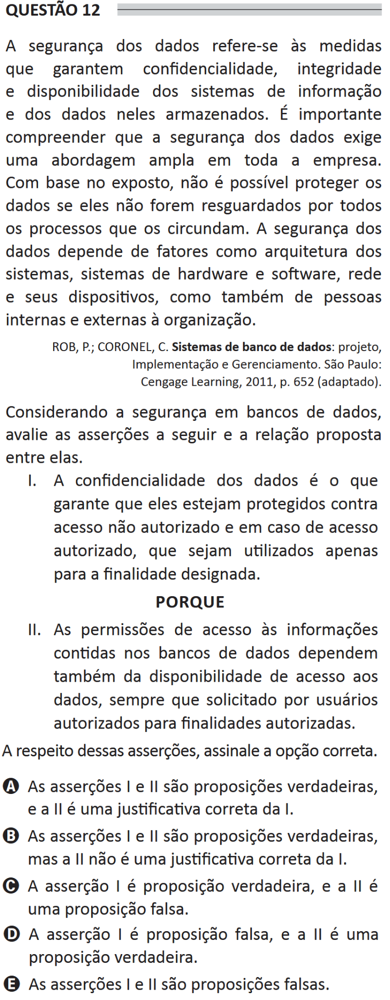

# ENADE 2021 Information Systems - Question 12

## Original question image

## English translation

Data security refers to measures that ensure the confidentiality, integrity, and availability of information systems and the data stored in them. It is important to understand that data security requires a broad approach throughout the company. Based on the information presented, data cannot be protected if they are not safeguarded by all processes surrounding them. Data security depends on factors such as system architecture, hardware and software systems, networks and their devices, as well as people inside and outside the organization.

ROB, P.; CORONEL, C. Database Systems: Design, Implementation, and Management. São Paulo: Cengage Learning, 2011, p. 652 (adapted).

Considering database security, evaluate the following assertions and the relationship proposed between them.

I. Data confidentiality is what ensures that data are protected against unauthorized access and that, in the case of authorized access, they are used only for the designated purpose.

BECAUSE

II. Access permissions to information contained in databases also depend on the availability of access to the data whenever requested by authorized users for authorized purposes.

Regarding these assertions, choose the correct option.

A. Assertions I and II are true, and II is a correct justification for I.  
B. Assertions I and II are true, but II is not a correct justification for I.  
C. Assertion I is true, and assertion II is false.  
D. Assertion I is false, and assertion II is true.  
E. Assertions I and II are false.

## Prompt

Answer the question(s) in this image by explaining step by step the reasoning used to answer it/them. Inform if any question is not clear or does not have a possible answer.
