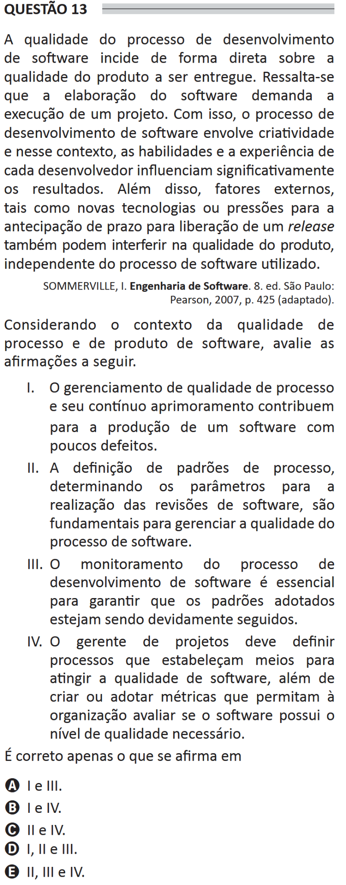

# ENADE 2021 Information Systems - Question 13

## Original question image

## English translation

The quality of the software development process directly affects the quality of the product to be delivered. It should be emphasized that software development requires the execution of a project. Thus, the software development process involves creativity and, in this context, the skills and experience of each developer significantly influence the results. In addition, external factors, such as new technologies or pressure to anticipate the release deadline, may also interfere with product quality, regardless of the software process used.

SOMMERVILLE, I. Software Engineering. 8th ed. São Paulo: Pearson, 2007, p. 425 (adapted).

Considering the context of software process and product quality, evaluate the following statements.

I. Software process quality management and its continuous improvement contribute to the production of software with few defects.  
II. The definition of process standards, determining the parameters for carrying out software reviews, is fundamental for managing the quality of the software process.  
III. Monitoring the software development process is essential to ensure that the adopted standards are properly followed.  
IV. The project manager must define processes that establish means to achieve software quality, as well as create or adopt metrics that allow the organization to evaluate whether the software has the necessary quality level.

It is correct only what is stated in:

A. I and III.  
B. I and IV.  
C. II and IV.  
D. I, II, and III.  
E. II, III, and IV.

## Prompt

Answer the question(s) in this image by explaining step by step the reasoning used to answer it/them. Inform if any question is not clear or does not have a possible answer.
