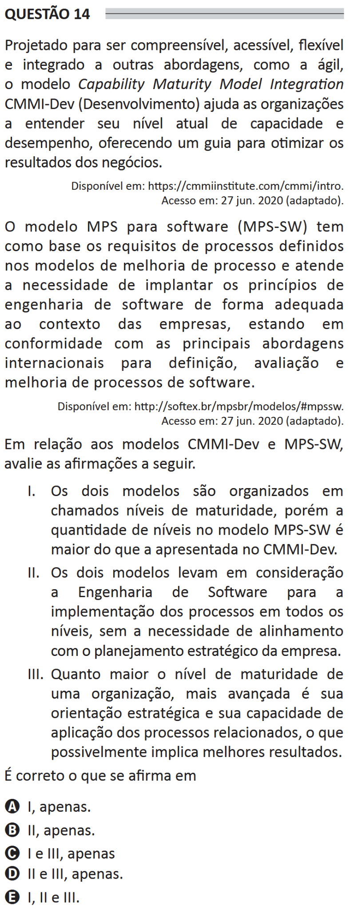

# ENADE 2021 Information Systems - Question 14

## Original question image

## English translation

Designed to be understandable, accessible, flexible, and integrated with other approaches, such as agile, the Capability Maturity Model Integration CMMI-Dev (Development) helps organizations understand their current level of capability and performance, providing guidance to optimize business results.

Available at: https://cmmiinstitute.com/cmmi/intro. Accessed on: June 27, 2020 (adapted).

The MPS model for software (MPS-SW) is based on the process requirements defined in process improvement models and meets the need to implement software engineering principles appropriately in the context of companies, being in compliance with the main international approaches for defining, evaluating, and improving software processes.

Available at: http://softex.br/mpsbr/modelos/#mpssw. Accessed on: June 27, 2020 (adapted).

Regarding the CMMI-Dev and MPS-SW models, evaluate the following statements.

I. Both models are organized into so-called maturity levels; however, the number of levels in the MPS-SW model is greater than that presented in CMMI-Dev.  
II. Both models take Software Engineering into consideration for implementing processes at all levels, without the need for alignment with the company’s strategic planning.  
III. The higher the maturity level of an organization, the more advanced its strategic orientation and its ability to apply the related processes, which may imply better results.

It is correct what is stated in:

A. I only.  
B. II only.  
C. I and III only.  
D. II and III only.  
E. I, II, and III.

## Prompt

Answer the question(s) in this image by explaining step by step the reasoning used to answer it/them. Inform if any question is not clear or does not have a possible answer.
