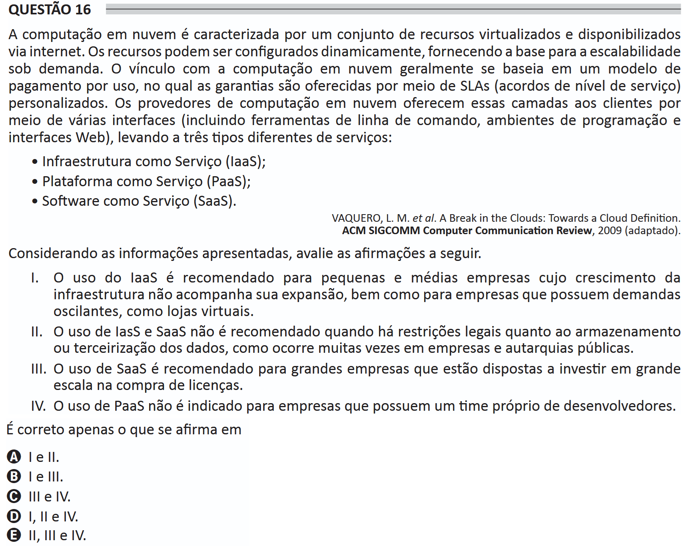

# ENADE 2021 Information Systems - Question 16

## Original question image

## English translation

Cloud computing is characterized by a set of virtualized resources made available via the internet. The resources can be dynamically configured, providing the basis for on-demand scalability. The link with cloud computing is generally based on a pay-per-use model, in which guarantees are offered through customized SLAs (service-level agreements). Cloud computing providers offer these layers to clients through various interfaces, including command-line tools, programming environments, and web interfaces, leading to three different types of services:

- Infrastructure as a Service (IaaS);
- Platform as a Service (PaaS);
- Software as a Service (SaaS).

VAQUERO, L. M. et al. A Break in the Clouds: Towards a Cloud Definition. ACM SIGCOMM Computer Communication Review, 2009 (adapted).

Considering the information presented, evaluate the following statements.

I. The use of IaaS is recommended for small and medium-sized companies whose infrastructure growth does not keep pace with their expansion, as well as for companies with fluctuating demands, such as online stores.  
II. The use of IaaS and SaaS is not recommended when there are legal restrictions regarding data storage or outsourcing, as often occurs in companies and public agencies.  
III. The use of SaaS is recommended for large companies that are willing to invest heavily in purchasing licenses.  
IV. The use of PaaS is not indicated for companies that have their own team of developers.

It is correct only what is stated in:

A. I and II.  
B. I and III.  
C. III and IV.  
D. I, II, and IV.  
E. II, III, and IV.

## Prompt

Answer the question(s) in this image by explaining step by step the reasoning used to answer it/them. Inform if any question is not clear or does not have a possible answer.
