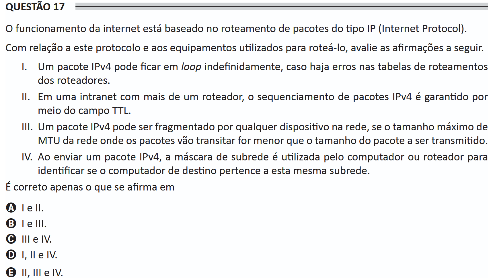

# ENADE 2021 Information Systems - Question 17

## Original question image

## English translation

The operation of the internet is based on IP (Internet Protocol) packet routing.

Regarding this protocol and the equipment used to route it, evaluate the following statements.

I. An IPv4 packet may remain in a loop indefinitely if there are errors in the routers’ routing tables.  
II. In an intranet with more than one router, IPv4 packet sequencing is guaranteed through the TTL field.  
III. An IPv4 packet may be fragmented by any device on the network if the maximum MTU size of the network through which the packets will travel is smaller than the size of the packet to be transmitted.  
IV. When sending an IPv4 packet, the subnet mask is used by the computer or router to identify whether the destination computer belongs to the same subnet.

It is correct only what is stated in:

A. I and II.  
B. I and III.  
C. III and IV.  
D. I, II, and IV.  
E. II, III, and IV.

## Prompt

Answer the question(s) in this image by explaining step by step the reasoning used to answer it/them. Inform if any question is not clear or does not have a possible answer.
