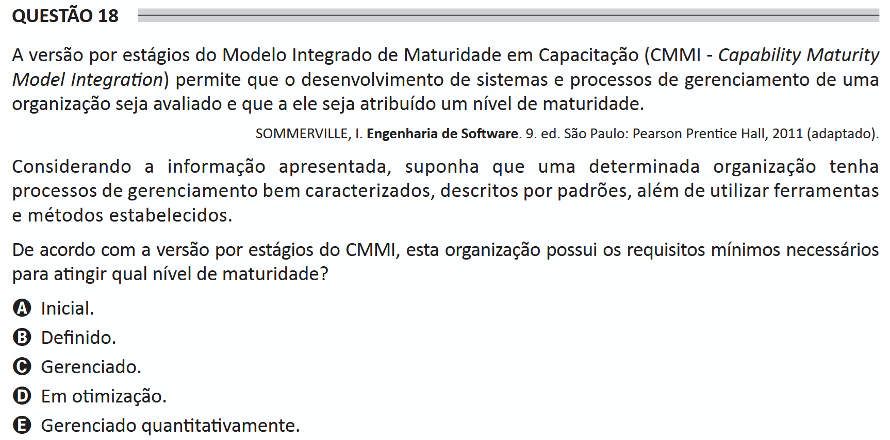

# ENADE 2021 Information Systems - Question 18

## Original question image

## English translation

The staged version of the Capability Maturity Model Integration (CMMI) allows the development of systems and management processes of an organization to be evaluated and assigned a maturity level.

SOMMERVILLE, I. Software Engineering. 9th ed. São Paulo: Pearson Prentice Hall, 2011 (adapted).

Considering the information presented, suppose that a certain organization has well-characterized management processes, described by standards, in addition to using established tools and methods.

According to the staged version of CMMI, what maturity level does this organization have the minimum requirements to achieve?

A. Initial.  
B. Defined.  
C. Managed.  
D. Optimizing.  
E. Quantitatively Managed.

## Prompt

Answer the question(s) in this image by explaining step by step the reasoning used to answer it/them. Inform if any question is not clear or does not have a possible answer.
