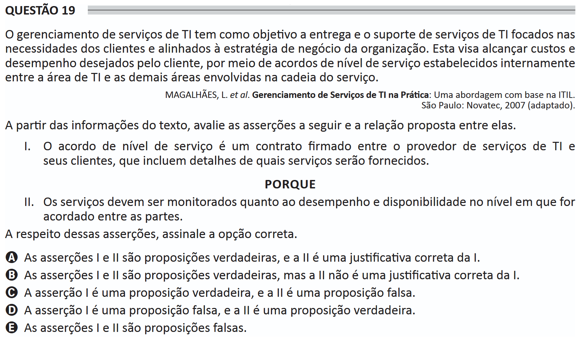

# ENADE 2021 Information Systems - Question 19

## Original question image

## English translation

IT service management aims at delivering and supporting IT services focused on clients’ needs and aligned with the organization’s business strategy. It seeks to achieve the costs and performance desired by the client through service-level agreements established internally between the IT area and the other areas involved in the service chain.

MAGALHÃES, L. et al. IT Service Management in Practice: An ITIL-based approach. São Paulo: Novatec, 2007 (adapted).

Based on the information in the text, evaluate the following assertions and the relationship proposed between them.

I. A service-level agreement is a contract signed between the IT service provider and its clients, including details about which services will be provided.

BECAUSE

II. Services must be monitored regarding performance and availability at the level agreed upon between the parties.

Regarding these assertions, choose the correct option.

A. Assertions I and II are true, and II is a correct justification for I.  
B. Assertions I and II are true, but II is not a correct justification for I.  
C. Assertion I is true, and assertion II is false.  
D. Assertion I is false, and assertion II is true.  
E. Assertions I and II are false.

## Prompt

Answer the question(s) in this image by explaining step by step the reasoning used to answer it/them. Inform if any question is not clear or does not have a possible answer.
