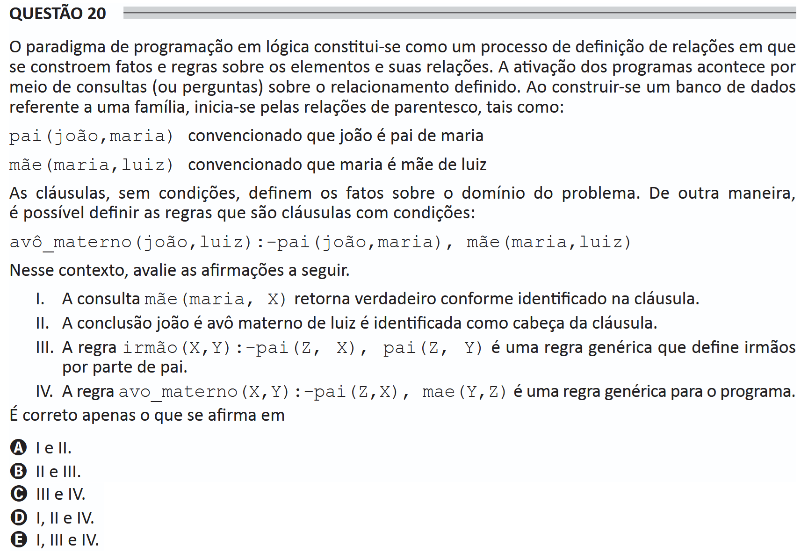

# ENADE 2021 Information Systems - Question 20

## Original question image



## English translation

The logic programming paradigm is constituted as a process of defining relations in which facts and rules about elements and their relationships are constructed. Programs are activated through queries, or questions, about the defined relationship. When building a database related to a family, one begins with kinship relations, such as:

```prolog
pai(joão,maria)
```

meaning that João is Maria’s father.

```prolog
mãe(maria,luiz)
```

meaning that Maria is Luiz’s mother.

Clauses without conditions define the facts about the problem domain. In another way, it is possible to define rules, which are clauses with conditions:

```prolog
avô_materno(joão,luiz) :- pai(joão,maria), mãe(maria,luiz)
```

In this context, evaluate the following statements.

I. The query `mãe(maria, X)` returns true as identified in the clause.  
II. The conclusion “João is Luiz’s maternal grandfather” is identified as the head of the clause.  
III. The rule `irmão(X,Y) :- pai(Z, X), pai(Z, Y)` is a generic rule that defines siblings through the father’s side.  
IV. The rule `avo_materno(X,Y) :- pai(Z,X), mae(Y,Z)` is a generic rule for the program.

It is correct only what is stated in:

A. I and II.  
B. II and III.  
C. III and IV.  
D. I, II, and IV.  
E. I, III, and IV.

## Prompt

Answer the question(s) in this image by explaining step by step the reasoning used to answer it/them. Inform if any question is not clear or does not have a possible answer.
