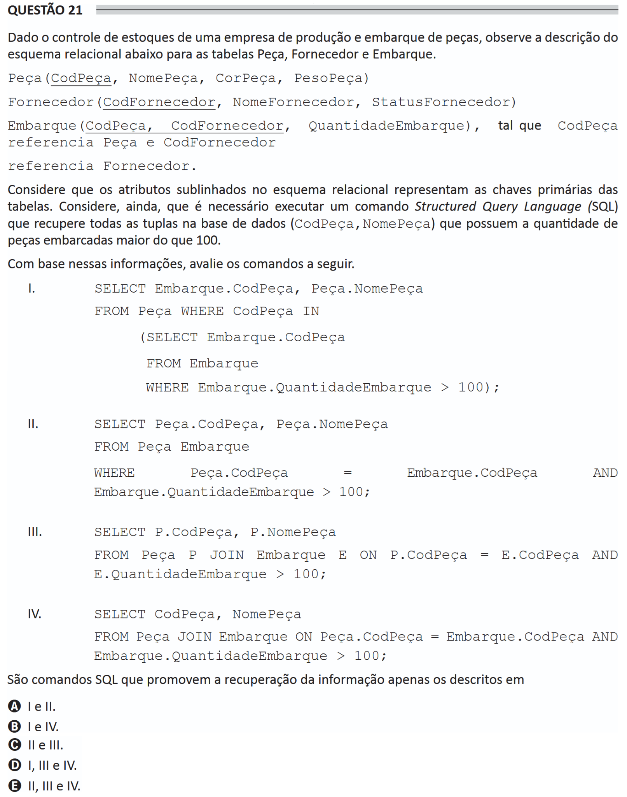

# ENADE 2021 Information Systems - Question 21

## Original question image



## English translation

Given the inventory control of a company that produces and ships parts, observe the description of the relational schema below for the tables `Peça`, `Fornecedor`, and `Embarque`.

```text
Peça(CodPeça, NomePeça, CorPeça, PesoPeça)

Fornecedor(CodFornecedor, NomeFornecedor, StatusFornecedor)

Embarque(CodPeça, CodFornecedor, QuantidadeEmbarque),
such that CodPeça references Peça and CodFornecedor references Fornecedor.
```

Consider that the underlined attributes in the relational schema represent the primary keys of the tables. Also consider that it is necessary to execute an SQL (Structured Query Language) command that retrieves all tuples in the database `(CodPeça, NomePeça)` that have a quantity of shipped parts greater than 100.

Based on this information, evaluate the following commands.

I.
```sql
SELECT Embarque.CodPeça, Peça.NomePeça
FROM Peça WHERE CodPeça IN
    (SELECT Embarque.CodPeça
     FROM Embarque
     WHERE Embarque.QuantidadeEmbarque > 100);
```

II.
```sql
SELECT Peça.CodPeça, Peça.NomePeça
FROM Peça Embarque
WHERE Peça.CodPeça = Embarque.CodPeça
  AND Embarque.QuantidadeEmbarque > 100;
```

III.
```sql
SELECT P.CodPeça, P.NomePeça
FROM Peça P JOIN Embarque E ON P.CodPeça = E.CodPeça
  AND E.QuantidadeEmbarque > 100;
```

IV.
```sql
SELECT CodPeça, NomePeça
FROM Peça JOIN Embarque ON Peça.CodPeça = Embarque.CodPeça
  AND Embarque.QuantidadeEmbarque > 100;
```

The SQL commands that retrieve the information are only those described in:

A. I and II.  
B. I and IV.  
C. II and III.  
D. I, III, and IV.  
E. II, III, and IV.

## Prompt

Answer the question(s) in this image by explaining step by step the reasoning used to answer it/them. Inform if any question is not clear or does not have a possible answer.
