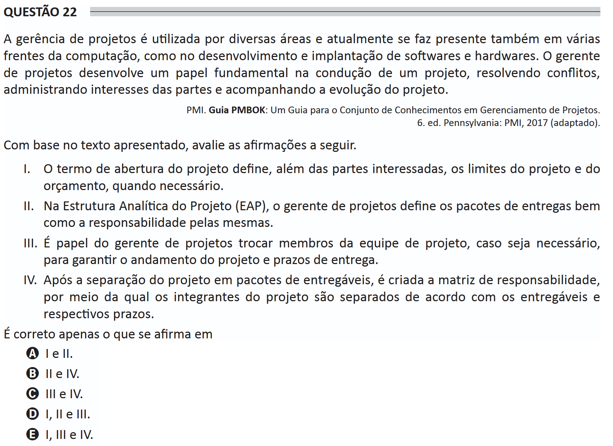

# ENADE 2021 Information Systems - Question 22

## Original question image

## English translation

Project management is used by several areas and is currently also present in many fronts of computing, such as the development and implementation of software and hardware. The project manager plays a fundamental role in conducting a project, resolving conflicts, managing stakeholders’ interests, and monitoring the project’s progress.

PMI. PMBOK Guide: A Guide to the Project Management Body of Knowledge. 6th ed. Pennsylvania: PMI, 2017 (adapted).

Based on the text presented, evaluate the following statements.

I. The project charter defines, in addition to stakeholders, the project and budget limits, when necessary.  
II. In the Work Breakdown Structure (WBS), the project manager defines the deliverable packages as well as the responsibility for them.  
III. It is the project manager’s role to replace project team members, if necessary, to ensure project progress and delivery deadlines.  
IV. After the project is divided into deliverable packages, a responsibility matrix is created, through which project members are assigned according to the deliverables and their respective deadlines.

It is correct only what is stated in:

A. I and II.  
B. II and IV.  
C. III and IV.  
D. I, II, and III.  
E. I, III, and IV.

## Prompt

Answer the question(s) in this image by explaining step by step the reasoning used to answer it/them. Inform if any question is not clear or does not have a possible answer.
