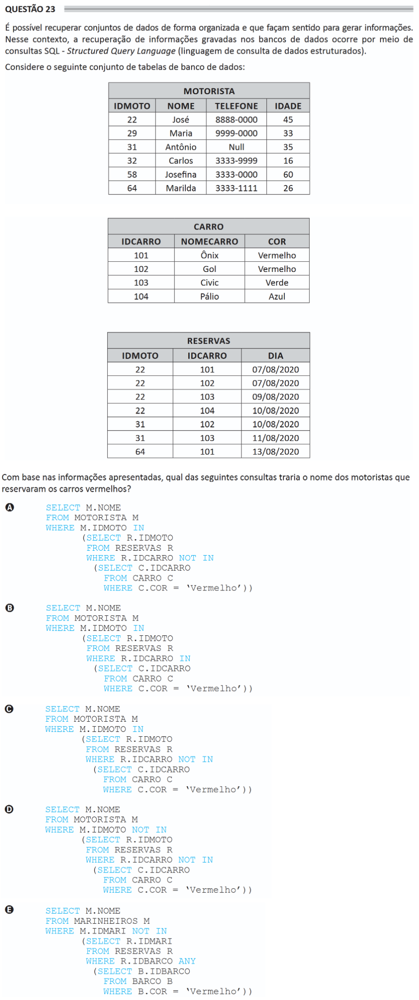

# ENADE 2021 Information Systems - Question 23

## Original question image



## English translation

It is possible to retrieve datasets in an organized way so that they make sense and generate information. In this context, retrieving information recorded in databases occurs through SQL — Structured Query Language queries.

Consider the following set of database tables:

- `MOTORISTA(IDMOTO, NOME, TELEFONE, IDADE)`
- `CARRO(IDCARRO, NOMECARRO, COR)`
- `RESERVAS(IDMOTO, IDCARRO, DIA)`

Based on the information presented, which of the following queries would return the names of the drivers who reserved red cars?

A.
```sql
SELECT M.NOME
FROM MOTORISTA M
WHERE M.IDMOTO IN
    (SELECT R.IDMOTO
     FROM RESERVAS R
     WHERE R.IDCARRO NOT IN
        (SELECT C.IDCARRO
         FROM CARRO C
         WHERE C.COR = 'Vermelho'))
```

B.
```sql
SELECT M.NOME
FROM MOTORISTA M
WHERE M.IDMOTO IN
    (SELECT R.IDMOTO
     FROM RESERVAS R
     WHERE R.IDCARRO IN
        (SELECT C.IDCARRO
         FROM CARRO C
         WHERE C.COR = 'Vermelho'))
```

C.
```sql
SELECT M.NOME
FROM MOTORISTA M
WHERE M.IDMOTO IN
    (SELECT R.IDMOTO
     FROM RESERVAS R
     WHERE R.IDCARRO NOT IN
        (SELECT C.IDCARRO
         FROM CARRO C
         WHERE C.COR = 'Vermelho'))
```

D.
```sql
SELECT M.NOME
FROM MOTORISTA M
WHERE M.IDMOTO NOT IN
    (SELECT R.IDMOTO
     FROM RESERVAS R
     WHERE R.IDCARRO NOT IN
        (SELECT C.IDCARRO
         FROM CARRO C
         WHERE C.COR = 'Vermelho'))
```

E.
```sql
SELECT M.NOME
FROM MARINHEIROS M
WHERE M.IDMARI NOT IN
    (SELECT R.IDMARI
     FROM RESERVAS R
     WHERE R.IDBARCO ANY
        (SELECT B.IDBARCO
         FROM BARCO B
         WHERE B.COR = 'Vermelho'))
```

## Prompt

Answer the question(s) in this image by explaining step by step the reasoning used to answer it/them. Inform if any question is not clear or does not have a possible answer.
