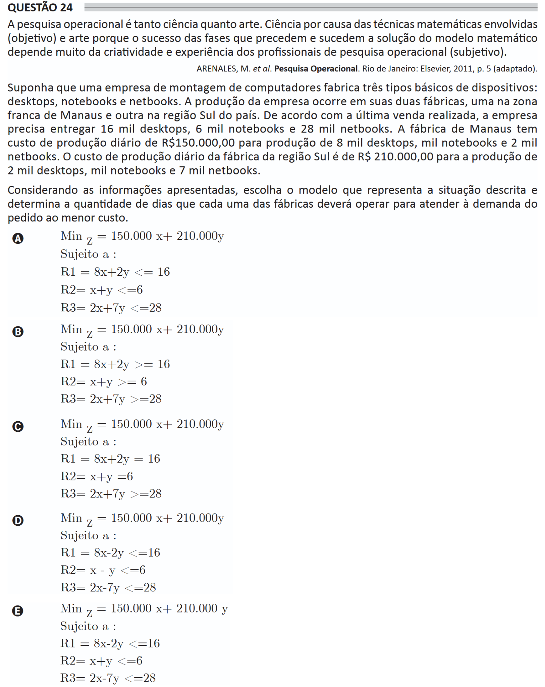

# ENADE 2021 Information Systems - Question 24

## Original question image



## English translation

Operations research is both science and art. It is science because of the mathematical techniques involved, which are objective, and it is art because the success of the phases that precede and follow the solution of the mathematical model depends heavily on the creativity and experience of operations research professionals, which are subjective.

ARENALES, M. et al. Operations Research. Rio de Janeiro: Elsevier, 2011, p. 5 (adapted).

Suppose that a computer assembly company manufactures three basic types of devices: desktops, notebooks, and netbooks. The company’s production takes place in two factories, one in the Manaus Free Trade Zone and another in the southern region of the country. According to the last sale made, the company must deliver 16 thousand desktops, 6 thousand notebooks, and 28 thousand netbooks. The Manaus factory has a daily production cost of R$150,000.00 for the production of 8 thousand desktops, 1 thousand notebooks, and 2 thousand netbooks. The daily production cost of the factory in the South region is R$210,000.00 for the production of 2 thousand desktops, 1 thousand notebooks, and 7 thousand netbooks.

Considering the information presented, choose the model that represents the described situation and determines the number of days that each factory should operate to meet the order demand at the lowest cost.

A.
```text
Min z = 150,000x + 210,000y
Subject to:
R1 = 8x + 2y <= 16
R2 = x + y <= 6
R3 = 2x + 7y <= 28
```

B.
```text
Min z = 150,000x + 210,000y
Subject to:
R1 = 8x + 2y >= 16
R2 = x + y >= 6
R3 = 2x + 7y >= 28
```

C.
```text
Min z = 150,000x + 210,000y
Subject to:
R1 = 8x + 2y = 16
R2 = x + y = 6
R3 = 2x + 7y >= 28
```

D.
```text
Min z = 150,000x + 210,000y
Subject to:
R1 = 8x - 2y <= 16
R2 = x - y <= 6
R3 = 2x - 7y <= 28
```

E.
```text
Min z = 150,000x + 210,000y
Subject to:
R1 = 8x - 2y <= 16
R2 = x + y <= 6
R3 = 2x - 7y <= 28
```

## Prompt

Answer the question(s) in this image by explaining step by step the reasoning used to answer it/them. Inform if any question is not clear or does not have a possible answer.
