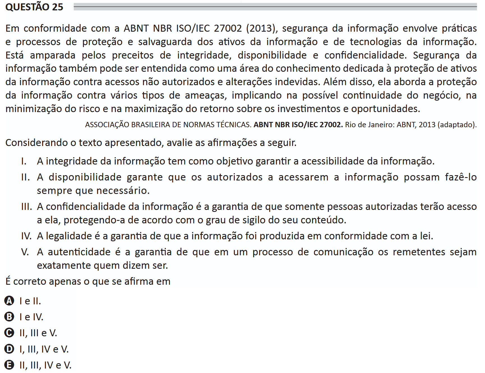

# ENADE 2021 Information Systems - Question 25

## Original question image

## English translation

In accordance with ABNT NBR ISO/IEC 27002 (2013), information security involves practices and processes for protecting and safeguarding information assets and information technologies. It is supported by the principles of integrity, availability, and confidentiality. Information security can also be understood as an area of knowledge dedicated to protecting information assets against unauthorized access and improper changes. In addition, it addresses the protection of information against various types of threats, contributing to possible business continuity, risk minimization, and maximization of return on investments and opportunities.

BRAZILIAN ASSOCIATION OF TECHNICAL STANDARDS. ABNT NBR ISO/IEC 27002. Rio de Janeiro: ABNT, 2013 (adapted).

Considering the text presented, evaluate the following statements.

I. Information integrity aims to guarantee the accessibility of information.  
II. Availability ensures that those authorized to access the information can do so whenever necessary.  
III. Information confidentiality is the guarantee that only authorized persons will have access to it, protecting it according to the degree of secrecy of its content.  
IV. Legality is the guarantee that the information was produced in accordance with the law.  
V. Authenticity is the guarantee that, in a communication process, senders are exactly who they claim to be.

It is correct only what is stated in:

A. I and II.  
B. I and IV.  
C. II, III, and V.  
D. I, III, IV, and V.  
E. II, III, IV, and V.

## Prompt

Answer the question(s) in this image by explaining step by step the reasoning used to answer it/them. Inform if any question is not clear or does not have a possible answer.
