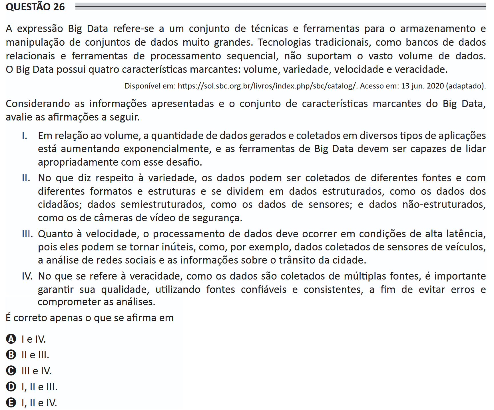

# ENADE 2021 Information Systems - Question 26

## Original question image

## English translation

The expression Big Data refers to a set of techniques and tools for storing and manipulating very large datasets. Traditional technologies, such as relational databases and sequential processing tools, do not support the vast volume of data. Big Data has four defining characteristics: volume, variety, velocity, and veracity.

Available at: https://sol.sbc.org.br/livros/index.php/sbc/catalog/. Accessed on: June 13, 2020 (adapted).

Considering the information presented and the set of defining characteristics of Big Data, evaluate the following statements.

I. Regarding volume, the amount of data generated and collected in different types of applications is increasing exponentially, and Big Data tools must be capable of properly handling this challenge.  
II. Regarding variety, data may be collected from different sources and with different formats and structures, and are divided into structured data, such as citizen data; semi-structured data, such as sensor data; and unstructured data, such as data from security video cameras.  
III. Regarding velocity, data processing must occur under high-latency conditions, because data may become useless, such as data collected from vehicle sensors, social network analysis, and information about city traffic.  
IV. Regarding veracity, since data are collected from multiple sources, it is important to ensure their quality by using reliable and consistent sources, in order to avoid errors and compromising the analyses.

It is correct only what is stated in:

A. I and IV.  
B. II and III.  
C. III and IV.  
D. I, II, and III.  
E. I, II, and IV.

## Prompt

Answer the question(s) in this image by explaining step by step the reasoning used to answer it/them. Inform if any question is not clear or does not have a possible answer.
