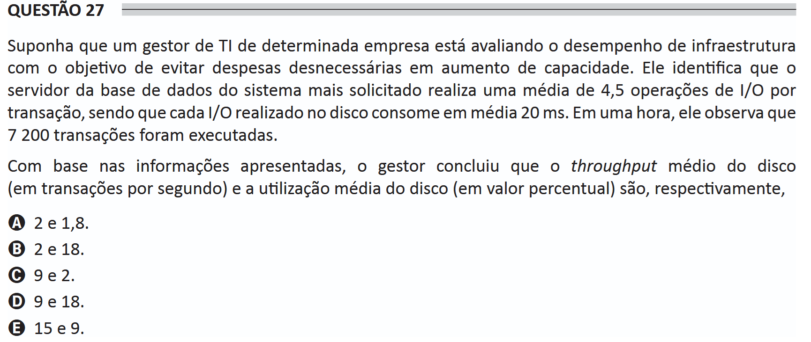

# ENADE 2021 Information Systems - Question 27

## Original question image

## English translation

Suppose that an IT manager of a certain company is evaluating infrastructure performance with the objective of avoiding unnecessary expenses on capacity increases. He identifies that the database server of the most requested system performs an average of 4.5 I/O operations per transaction, and that each I/O operation performed on disk consumes an average of 20 ms. In one hour, he observes that 7,200 transactions were executed.

Based on the information presented, the manager concluded that the average disk throughput, in transactions per second, and the average disk utilization, as a percentage, are respectively:

A. 2 and 1.8.  
B. 2 and 18.  
C. 9 and 2.  
D. 9 and 18.  
E. 15 and 9.

## Prompt

Answer the question(s) in this image by explaining step by step the reasoning used to answer it/them. Inform if any question is not clear or does not have a possible answer.
