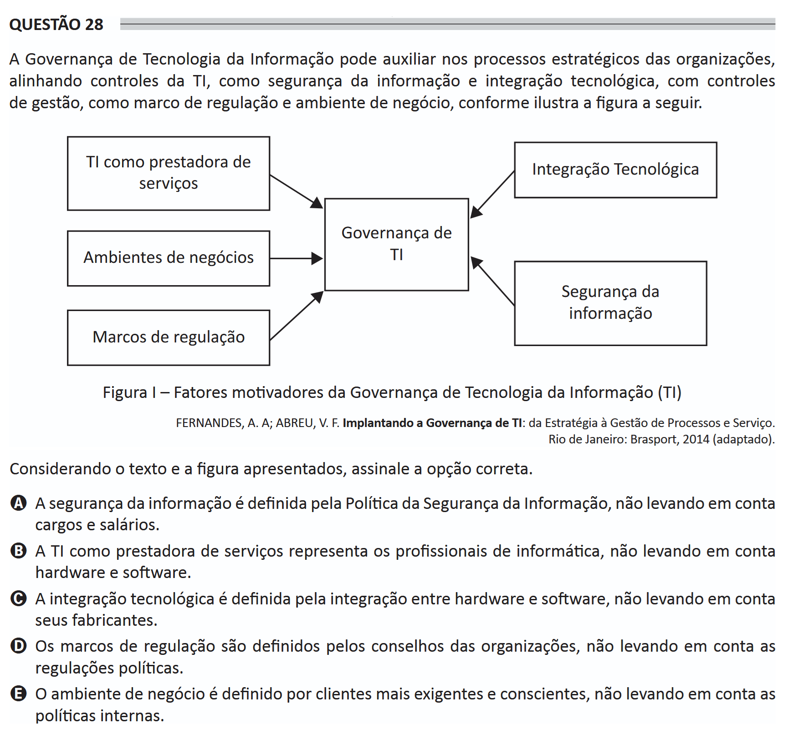

# ENADE 2021 Information Systems - Question 28

## Original question image

## English translation

Information Technology Governance can assist in organizations’ strategic processes by aligning IT controls, such as information security and technological integration, with management controls, such as regulatory frameworks and business environment, as illustrated in the following figure.

Figure I — Motivating factors of Information Technology Governance (IT)

Considering the text and the figure presented, choose the correct option.

A. Information security is defined by the Information Security Policy, not taking positions and salaries into account.  
B. IT as a service provider represents IT professionals, not taking hardware and software into account.  
C. Technological integration is defined by the integration between hardware and software, not taking their manufacturers into account.  
D. Regulatory frameworks are defined by organizations’ boards, not taking political regulations into account.  
E. The business environment is defined by more demanding and aware clients, not taking internal policies into account.

## Prompt

Answer the question(s) in this image by explaining step by step the reasoning used to answer it/them. Inform if any question is not clear or does not have a possible answer.
