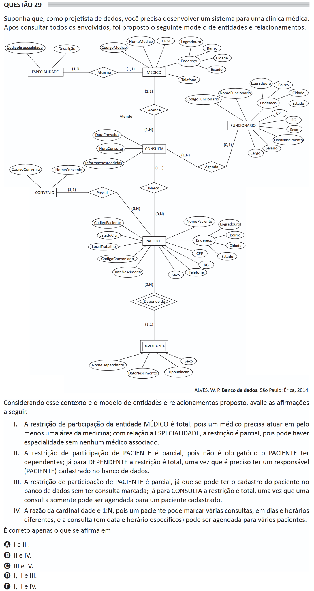

# ENADE 2021 Information Systems - Question 29

## Original question image

## English translation

Suppose that, as a data designer, you need to develop a system for a medical clinic. After consulting all stakeholders, the following entity-relationship model was proposed.

ALVES, W. P. Databases. São Paulo: Érica, 2014.

Considering this context and the proposed entity-relationship model, evaluate the following statements.

I. The participation constraint of the entity PHYSICIAN is total, because a physician must work in at least one area of medicine; regarding SPECIALTY, the constraint is partial, because there may be a specialty without any associated physician.

II. The participation constraint of PATIENT is partial, because it is not mandatory for a PATIENT to have dependents; for DEPENDENT, the constraint is total, since it is necessary to have a responsible person (PATIENT) registered in the database.

III. The participation constraint of PATIENT is partial, since the patient may be registered in the database without having any appointment scheduled; for APPOINTMENT, the constraint is total, since an appointment can only be scheduled for a registered patient.

IV. The cardinality ratio is 1:N, because a patient can schedule several appointments on different days and times, and the appointment, on a specific date and time, can be scheduled for several patients.

It is correct only what is stated in:

A. I and III.  
B. II and IV.  
C. III and IV.  
D. I, II, and III.  
E. I, II, and IV.

## Prompt

Answer the question(s) in this image by explaining step by step the reasoning used to answer it/them. Inform if any question is not clear or does not have a possible answer.
