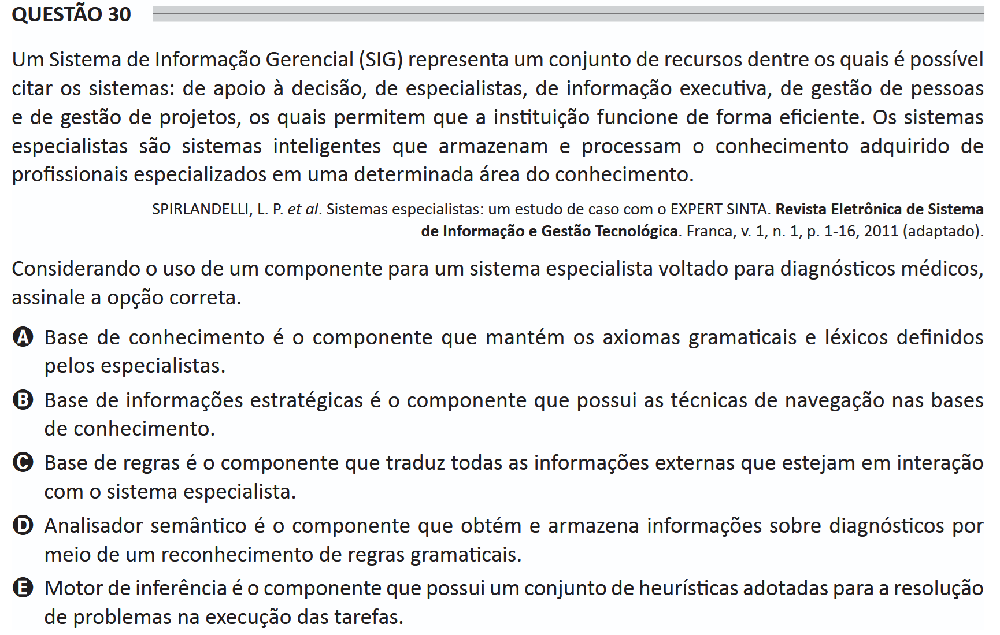

# ENADE 2021 Information Systems - Question 30

## Original question image

## English translation

A Management Information System (MIS) represents a set of resources among which it is possible to mention systems for decision support, expert systems, executive information, people management, and project management, which allow the institution to function efficiently. Expert systems are intelligent systems that store and process knowledge acquired from professionals specialized in a specific area of knowledge.

SPIRLANDELLI, L. P. et al. Expert systems: a case study with EXPERT SINTA. Electronic Journal of Information Systems and Technological Management. Franca, v. 1, n. 1, p. 1-16, 2011 (adapted).

Considering the use of a component for an expert system aimed at medical diagnoses, choose the correct option.

A. The knowledge base is the component that maintains the grammatical and lexical axioms defined by the specialists.  
B. The strategic information base is the component that contains the navigation techniques in the knowledge bases.  
C. The rule base is the component that translates all external information that is interacting with the expert system.  
D. The semantic analyzer is the component that obtains and stores information about diagnoses through the recognition of grammatical rules.  
E. The inference engine is the component that has a set of heuristics adopted for solving problems during task execution.

## Prompt

Answer the question(s) in this image by explaining step by step the reasoning used to answer it/them. Inform if any question is not clear or does not have a possible answer.
