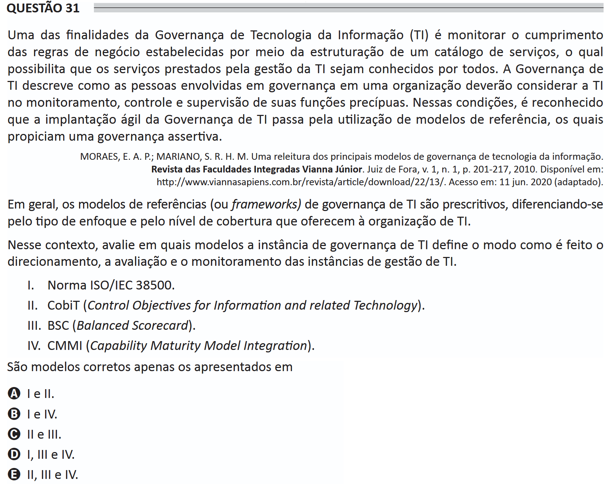

# ENADE 2021 Information Systems - Question 31

## Original question image

## English translation

One of the purposes of Information Technology (IT) Governance is to monitor compliance with business rules established through the structuring of a service catalog, which makes it possible for the services provided by IT management to be known by everyone. IT Governance describes how people involved in governance within an organization should consider IT in monitoring, controlling, and supervising its core functions. Under these conditions, it is recognized that the agile implementation of IT Governance involves the use of reference models, which provide assertive governance.

MORAES, E. A. P.; MARIANO, S. R. H. M. A rereading of the main models of information technology governance. Revista das Faculdades Integradas Vianna Júnior, Juiz de Fora, v. 1, n. 1, p. 201-217, 2010. Available at: http://www.viannasapiens.com.br/revista/article/download/22/13/. Accessed on: June 11, 2020 (adapted).

In general, IT governance reference models, or frameworks, are prescriptive, differing in the type of focus and the level of coverage they offer to the IT organization.

In this context, evaluate in which models the IT governance instance defines how the direction, evaluation, and monitoring of IT management instances are carried out.

I. ISO/IEC 38500 standard.  
II. CobiT (Control Objectives for Information and Related Technology).  
III. BSC (Balanced Scorecard).  
IV. CMMI (Capability Maturity Model Integration).

The correct models are only those presented in:

A. I and II.  
B. I and IV.  
C. II and III.  
D. I, III, and IV.  
E. II, III, and IV.

## Prompt

Answer the question(s) in this image by explaining step by step the reasoning used to answer it/them. Inform if any question is not clear or does not have a possible answer.
