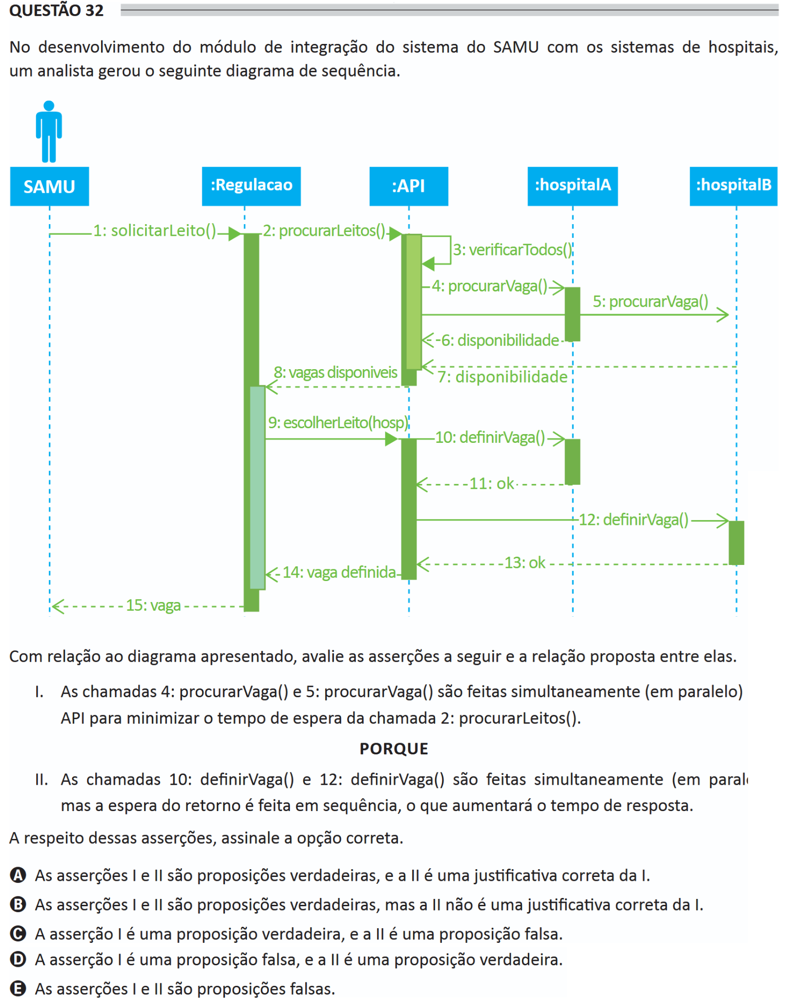

# ENADE 2021 Information Systems - Question 32

## Original question image

## English translation

In the development of the integration module of the SAMU system with hospital systems, an analyst generated the following sequence diagram.

Regarding the diagram presented, evaluate the following assertions and the relationship proposed between them.

I. Calls 4, `procurarVaga()`, and 5, `procurarVaga()`, are made simultaneously, in parallel, by the API in order to minimize the waiting time of call 2, `procurarLeitos()`.

BECAUSE

II. Calls 10, `definirVaga()`, and 12, `definirVaga()`, are made simultaneously, in parallel, but waiting for their returns is performed sequentially, which will increase the response time.

Regarding these assertions, choose the correct option.

A. Assertions I and II are true, and II is a correct justification for I.  
B. Assertions I and II are true, but II is not a correct justification for I.  
C. Assertion I is true, and assertion II is false.  
D. Assertion I is false, and assertion II is true.  
E. Assertions I and II are false.

## Prompt

Answer the question(s) in this image by explaining step by step the reasoning used to answer it/them. Inform if any question is not clear or does not have a possible answer.
