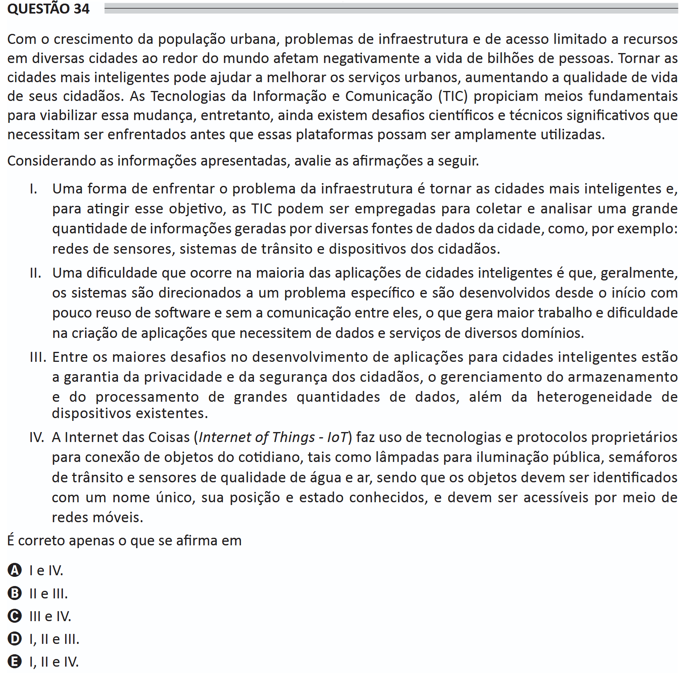

# ENADE 2021 Information Systems - Question 34

## Original question image

## English translation

With the growth of the urban population, infrastructure problems and limited access to resources in many cities around the world negatively affect the lives of billions of people. Making cities smarter can help improve urban services, increasing the quality of life of their citizens. Information and Communication Technologies (ICT) provide fundamental means to make this change possible; however, there are still significant scientific and technical challenges that must be faced before these platforms can be widely used.

Considering the information presented, evaluate the following statements.

I. One way to address the infrastructure problem is to make cities smarter and, to achieve this objective, ICT can be employed to collect and analyze a large amount of information generated by different data sources in the city, such as sensor networks, traffic systems, and citizens’ devices.

II. A difficulty that occurs in most smart city applications is that systems are generally directed to a specific problem and are developed from the beginning with little software reuse and without communication between them, which creates more work and difficulty in creating applications that require data and services from different domains.

III. Among the greatest challenges in developing applications for smart cities are ensuring citizens’ privacy and security, managing the storage and processing of large amounts of data, and dealing with the heterogeneity of existing devices.

IV. The Internet of Things (IoT) uses proprietary technologies and protocols to connect everyday objects, such as public lighting lamps, traffic lights, and water and air quality sensors, and the objects must be identified by a unique name, have known position and state, and must be accessible through mobile networks.

It is correct only what is stated in:

A. I and IV.  
B. II and III.  
C. III and IV.  
D. I, II, and III.  
E. I, II, and IV.

## Prompt

Answer the question(s) in this image by explaining step by step the reasoning used to answer it/them. Inform if any question is not clear or does not have a possible answer.
