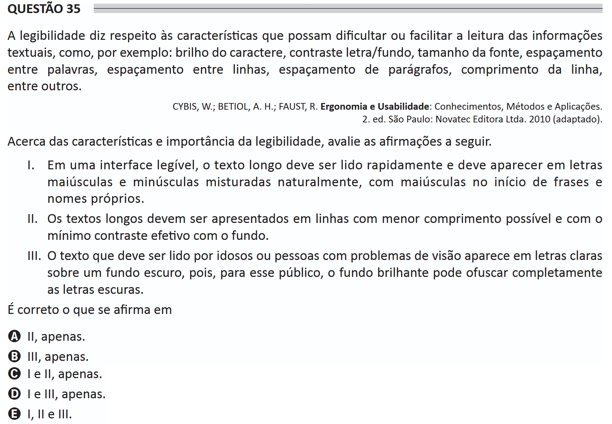

# ENADE 2021 Information Systems - Question 35

## Original question image

## English translation

Legibility concerns the characteristics that may hinder or facilitate the reading of textual information, such as, for example, character brightness, letter/background contrast, font size, word spacing, line spacing, paragraph spacing, line length, among others.

CYBIS, W.; BETIOL, A. H.; FAUST, R. Ergonomics and Usability: Knowledge, Methods, and Applications. 2nd ed. São Paulo: Novatec Editora Ltda., 2010 (adapted).

Regarding the characteristics and importance of legibility, evaluate the following statements.

I. In a legible interface, long text should be read quickly and should appear with uppercase and lowercase letters naturally mixed, with uppercase letters at the beginning of sentences and proper names.

II. Long texts should be presented in lines with the shortest possible length and with the minimum effective contrast against the background.

III. Text intended to be read by elderly people or people with vision problems appears in light letters on a dark background because, for this audience, a bright background may completely dazzle dark letters.

It is correct what is stated in:

A. II only.  
B. III only.  
C. I and II only.  
D. I and III only.  
E. I, II, and III.

## Prompt

Answer the question(s) in this image by explaining step by step the reasoning used to answer it/them. Inform if any question is not clear or does not have a possible answer.
